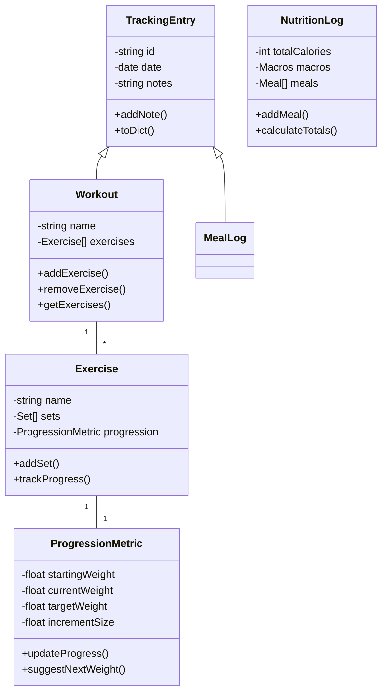

# Workout Tracker API Design Document

## Introduction

The Workout Tracker API provides a comprehensive system for fitness enthusiasts to plan, track, and analyze their workouts, nutrition, and progressive overload. The API enables users to create workout plans, log exercises with multiple sets and reps, track caloric intake, and monitor their progress over time through a RESTful interface.

## Background/Context

Many fitness enthusiasts struggle to consistently track their workout progress, nutrition, and maintain structured exercise routines. While numerous fitness apps exist, users often need a personalized solution that accurately captures their specific workout patterns, nutrition goals, and progression targets. This API addresses these needs by providing a robust backend system for comprehensive fitness management and progress tracking.

## Stakeholders

- **Fitness Enthusiasts**: Primary users tracking their workouts, nutrition, and progress
- **Personal Trainers**: Professionals creating and monitoring client workout plans and nutrition
- **Nutritionists**: Professionals monitoring client dietary patterns
- **Gym Owners**: Business owners tracking member activities
- **App Developers**: Technical users integrating fitness tracking into applications

## Functional Requirements

1. **Resource Creation**

   - Create new workouts, exercises, and workout plans via POST requests
   - Log daily caloric intake and macronutrient breakdown
   - Track progressive overload metrics for each exercise
   - Add multiple sets and reps for each exercise
   - Validate all incoming data against predefined schemas
   - Return 201 Created status code with the created resource

2. **Resource Retrieval**

   - Retrieve lists of workouts, exercises, nutrition logs, and workout plans via GET requests
   - Get detailed information for specific resources by ID
   - View progressive overload trends over time
   - Return 200 OK status code with requested resources

3. **Resource Update**

   - Update existing workouts, exercises, nutrition logs, and sets via PUT requests
   - Validate all update data against schemas
   - Return 200 OK status code with updated resource

4. **Resource Deletion**

   - Delete workouts, exercises, nutrition logs, and plans via DELETE requests
   - Return 204 No Content status code on success
   - Return 403 Forbidden for unauthorized deletion attempts

5. **Data Persistence**
   - Save all resources to file when service stops
   - Load resources from file when service starts

## Use Case Description

### Workouts

- **Create**: As a user, I want to create a new workout session to track my exercises
- **Read**: As a user, I want to view my workout history to monitor progress
- **Update**: As a user, I want to modify workout details as I complete exercises
- **Delete**: As a user, I want to remove incorrect workout entries

### Nutrition Tracking

- **Create**: As a user, I want to log my daily caloric intake and macronutrients
- **Read**: As a user, I want to view my nutrition history and patterns
- **Update**: As a user, I want to modify food entries as needed
- **Delete**: As a user, I want to remove incorrect nutrition entries

### Progressive Overload

- **Track**: As a user, I want to monitor my strength progression over time
- **Analyze**: As a user, I want to view trends in my lifting performance
- **Set Goals**: As a user, I want to set progressive overload targets
- **Get Insights**: As a user, I want to receive suggestions for weight progression

### WorkoutPlans

- **Create**: As a user, I want to create workout templates with progressive overload targets
- **Read**: As a user, I want to view my saved workout plans
- **Update**: As a user, I want to modify my workout plans as I progress
- **Delete**: As a user, I want to remove outdated workout plans

## List Of Resources

- **Workout**: A single workout session
- **Exercise**: A specific exercise within a workout
- **Set**: A set of repetitions for an exercise
- **WorkoutPlan**: A template for future workouts
- **NutritionLog**: Daily nutrition tracking entry
- **ProgressionMetric**: Progressive overload tracking for exercises

## List of End Points

### Workouts

[Previous workout endpoints remain the same]

### Nutrition

- **POST** `/api/nutrition`

  - **Description**: Create a new nutrition log entry
  - **Request Body**:
    ```
    {
      "date": "2024-11-15",
      "totalCalories": 2500,
      "macros": {
        "protein": 180,
        "carbs": 250,
        "fats": 80
      },
      "meals": [
        {
          "name": "Breakfast",
          "calories": 500,
          "foods": [...]
        }
      ]
    }
    ```
  - **Response**: 201 Created with nutrition log object

- **GET** `/api/nutrition`

  - **Description**: Retrieve all nutrition logs
  - **Response**: 200 OK with array of nutrition logs

- **GET** `/api/nutrition/{date}`
  - **Description**: Get specific day's nutrition details
  - **Response**: 200 OK with nutrition log object

### Progressive Overload

- **GET** `/api/progress/{exerciseId}`

  - **Description**: Get progression history for an exercise
  - **Response**: 200 OK with array of progression data

- **POST** `/api/progress/goals`
  - **Description**: Set progression goals for exercises
  - **Request Body**:
    ```
    {
      "exerciseId": "1",
      "targetWeight": 225,
      "targetDate": "2024-12-31",
      "incrementSize": 5
    }
    ```
  - **Response**: 201 Created with goal object

## UML Class Diagram



## Error Handling

- 400 Bad Request: Invalid data format
- 401 Unauthorized: Authentication required
- 403 Forbidden: Insufficient permissions
- 404 Not Found: Resource not found
- 500 Internal Server Error: Server-side issues

## Security Considerations

- JWT authentication required for all endpoints
- User-specific data isolation
- Input validation and sanitization
- Rate limiting on API endpoints
- Secure password storage and handling

## Future Enhancements

1. Integration with popular fitness devices and apps
2. Machine learning-based progression recommendations
3. Social features for sharing and comparing progress
4. Advanced nutrition planning and meal suggestions
5. Automated workout plan adjustments based on progress
